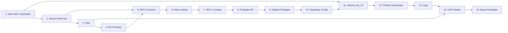

# Varredura de Segurança — 34 Vulnerabilidades

> Data: 2026-07-14
> Projeto: Centro Educacional Evolução (educational-erp)

---

## Histórico de Correções

| # | Descrição | Status | Data |
|---|-----------|--------|------|
| 1.1 | `admin_delete_user` sem role check | <input type="checkbox" checked> Resolvido | 2026-07-14 |
| 1.2 | `admin_update_user_profile` (5-param) sem role check | <input type="checkbox" checked> Resolvido | 2026-07-14 |
| 2.1 | `createResponsavelClient()` com SERVICE_ROLE_KEY | <input type="checkbox" checked> Mitigado (abordagem B: fix PII + mutation RPCs) | 2026-07-14 |
| 2.2 | `console.log` vazando prefixo da SERVICE_ROLE_KEY | <input type="checkbox" checked> Resolvido | 2026-07-14 |
| 5.1 | `get_aluno_basico` retorna 54 colunas de PII | <input type="checkbox" checked> Resolvido | 2026-07-14 |
| 11.1 | Lógica `sb_` invertida quebra produção | <input type="checkbox" checked> Resolvido | 2026-07-14 |

---

## Sumário Executivo

Varredura completa de segurança identificou **34 vulnerabilidades** no projeto, organizadas abaixo por sessões de correção. Cada sessão é independente e pode ser atacada separadamente.

### Resumo por Severidade

| Severidade | Total | Resolvidos |
|------------|-------|------------|
| Crítica    | 4     | 4 (1 mitigado) |
| Alta       | 10    | 1 |
| Média      | 11    | 0 |
| Baixa      | 9     | 0 |

---

## Sessão 1 — Funções SECURITY DEFINER sem Role Check (2 itens, críticos)

Dependências: Nenhuma
Esforço: Pequeno (~15 min)

### 1.1 — `admin_delete_user` sem role check ✅ Resolvido

**Severidade:** Crítica
**Arquivo:** `supabase/migrations/20260628000006_sync_professor_profile.sql:41-59`
**Correção aplicada em:** `supabase/migrations/20260709000002_fix_admin_functions_role_checks.sql`
**Problema:** A função `CREATE OR REPLACE FUNCTION public.admin_delete_user(p_user_id UUID)` sobrescreveu a versão com role check da migration anterior. SECURITY DEFINER + sem verificação = qualquer usuário autenticado pode deletar qualquer usuário (incluindo admins) de `auth.users`.
**Correção original:** Adicionar no início da função:

```sql
IF NOT EXISTS (
  SELECT 1 FROM public.profiles
  WHERE id = auth.uid()
  AND tipo_usuario IN ('admin', 'diretor')
) THEN
  RAISE EXCEPTION 'access_denied' USING HINT = 'Only administrators can execute this function';
END IF;
```

### 1.2 — `admin_update_user_profile` (5-param) sem role check ✅ Resolvido

**Severidade:** Crítica
**Arquivo:** `supabase/migrations/20260628000006_sync_professor_profile.sql:6-38`
**Correção aplicada em:** `supabase/migrations/20260709000002_fix_admin_functions_role_checks.sql`
**Problema:** Nova overload de 5 parâmetros foi criada SEM role check, e a migration seguinte (`20260709000000_drop_admin_update_user_profile_3params.sql`) dropa a versão de 3 params QUE TINHA role check. Resultado: qualquer usuário pode chamar `admin_update_user_profile(...)` para se auto-promover a admin e alterar email em `auth.users`.
**Correção:** Adicionar o mesmo role check do item 1.1 no início do corpo da função.

---

## Sessão 2 — Cliente Supabase com Service Role Key (2 itens, críticos)

Dependências: Nenhuma
Esforço: Médio (~2-3h, envolve criar RLS policies)

### 2.1 — `createResponsavelClient()` usa SERVICE_ROLE_KEY ✅ Mitigado

**Severidade:** Crítica
**Arquivo:** `lib/supabase/responsavel-client.ts:3-17`
**Status:** Mitigado via Abordagem B (ver docs/decisions/2026-07-14-responsavel-rpc-security.md)
**Problema:** Usa `SUPABASE_SERVICE_ROLE_KEY` que bypassa RLS. Usado em 4 locais: login, dashboard, notas, agenda do responsável. Qualquer query via este cliente tem acesso irrestrito a todas as tabelas.
**Correção aplicada:**
1. `get_aluno_basico` reduzido de 54 colunas para 10 (PII leak fix)
2. `revogar_sessoes_responsavel` teve EXECUTE revogado de `authenticated`
3. Manutenção do service_role mantida (JWT custom já valida cada request)
**Correção alternativa (não aplicada, plano C05 original):**
1. Criar `createResponsavelClient()` usando `NEXT_PUBLIC_SUPABASE_ANON_KEY`
2. Criar RLS policies que escopem acesso do responsável apenas aos próprios dados

### 2.2 — `console.log` vazando prefixo da SERVICE_ROLE_KEY ✅ Resolvido

**Severidade:** Crítica
**Arquivo:** `app/(authenticated)/ferramentas/export-import/actions/export.ts:32-34`
**Problema:** Loga `supabaseKey?.substring(0, 10)` e `supabaseKey?.length` em produção.
**Correção:** Linhas 32-34 removidas.

---

## Sessão 3 — Stored XSS via dangerouslySetInnerHTML (9 instâncias)

Dependências: Nenhuma
Esforço: Médio (~1h, instalar DOMPurify + criar helper + sanitizar)

### 3.1 a 3.9 — Conteúdo TipTap sem sanitização

**Severidade:** Alta
**Arquivos:**

- `app/(authenticated)/agenda-aluno/[alunoId]/page.tsx:631` — `selectedAviso.descricao`
- `app/(authenticated)/agenda/page.tsx:638` — `selectedEvento.descricao`
- `app/(authenticated)/alunos/[id]/page.tsx:398` — `aluno.medicamento_continuo_qual`
- `app/(authenticated)/alunos/[id]/page.tsx:407` — `aluno.alergia_medicamento_qual`
- `app/(authenticated)/alunos/[id]/page.tsx:416` — `aluno.alergia_alimento_qual`
- `app/(authenticated)/alunos/[id]/page.tsx:464` — `aluno.observacoes`
- `app/(authenticated)/disciplinas/[id]/page.tsx:108` — `disciplina.descricao`
- `app/(authenticated)/diario/[...]/presencas/[aulaId]/page.tsx:277` — `aula.conteudo_ministrado`
- `app/(authenticated)/diario/[...]/presencas/[aulaId]/page.tsx:285` — `aula.observacoes`

**Correção:**

1. Instalar `isomorphic-dompurify`
2. Criar `lib/sanitize.ts` com helper que usa DOMPurify
3. Sanitizar no write (server actions antes de salvar) e no read (antes de passar ao `__html`)

---

## Sessão 4 — RLS Policies Inexistentes ou Insuficientes (4 itens, altos)

Dependências: Nenhuma
Esforço: Médio (~2h)

### 4.1 — `notas` sem RLS (leitura, inserção, atualização liberadas para qualquer authenticated)

**Arquivo:** `supabase/migrations/20260619191517_remote_schema.sql:424-430`
**Correção:** Restringir com role check de admin/diretor/coordenação/professor da disciplina.

### 4.2 — `avisos_aluno` sem RLS (CRUD completo liberado para qualquer authenticated)

**Arquivo:** `supabase/migrations/20260619191517_remote_schema.sql:289-292`
**Correção:** Restringir INSERT/UPDATE/DELETE a staff; SELECT a staff ou responsável do aluno.

### 4.3 — `professor_disciplinas` sem RLS (qualquer professor pode se auto-vincular a qualquer disciplina)

**Arquivo:** `supabase/migrations/20260619191517_remote_schema.sql:474-477`
**Correção:** Mutations apenas para admin/diretor/coordenação.

### 4.4 — `user_invites` sem RLS (qualquer authenticated vê e cria convites, incluindo para role admin)

**Arquivo:** `supabase/migrations/20260627000001_add_user_invites_rls.sql:1-8`
**Correção:** SELECT/INSERT/DELETE apenas para admin/diretor.

---

## Sessão 5 — RPC Functions Expostas e sem Autorização (3 itens, alto)

Dependências: Idealmente depois da Sessão 2
Esforço: Médio (~1h)

### 5.1 — `get_aluno_basico` retorna 54 colunas de PII ✅ Resolvido

**Severidade:** Alta
**Arquivo:** `supabase/migrations/20260621000001_responsavel_rpc_pages.sql:2-19`
**Correção aplicada em:** `supabase/migrations/20260709000002_fix_responsavel_rpc_security.sql`
**Problema:** `SELECT to_jsonb(a.*)` retorna CPF, RG, endereço, dados médicos, dados dos pais, etc. FUNÇÃO SECURITY DEFINER.
**Correção:** Alterado para `jsonb_build_object` com 10 colunas (apenas as usadas).

### 5.2 — RPCs SECURITY DEFINER sem verificação de ownership

**Severidade:** Alta
**Arquivos:** `20260621000000_responsavel_rpc.sql`, `20260621000001_responsavel_rpc_pages.sql`, `20260625000000_fix_responsavel_cpf_search.sql`
**Funções:** `get_aluno_basico`, `get_avisos_aluno`, `get_aluno_notas`, `get_matricula_ativa`, `get_turma`, `get_escola`
**Problema:** Todas aceitam `p_aluno_id` e retornam dados sem verificar se o caller é o responsável ou staff autorizado. SÃO `GRANT EXECUTE TO authenticated`.
**Correção:** Adicionar verificação de autorização em cada função validando se o `auth.uid()` corresponde ao responsável ou é staff.

### 5.3 — `handle_new_user` confia em `raw_user_meta_data.tipo_usuario`

**Severidade:** Alta
**Arquivo:** `supabase/migrations/20260619191517_remote_schema.sql:115`
**Problema:** `raw_user_meta_data->>'tipo_usuario'` é controlado pelo usuário no signup. Um atacante pode se cadastrar como admin.
**Correção:** Hardcodar `'professor'` como default ou validar server-side.

---

## Sessão 6 — Rate Limiting (2 itens, alta + baixa)

Dependências: Nenhuma
Esforço: Médio (~1h)

### 6.1 — Rate limiter in-memory ineficaz em serverless

**Severidade:** Alta
**Arquivo:** `lib/rate-limit.ts:6`
**Problema:** `Map<string, RateLimitEntry>` em memória. Na Vercel cada instância tem memória isolada — atacante burla facilmente.
**Correção:** Substituir por `@upstash/ratelimit` com Redis, ou usar tabela no Supabase com cleanup periódico.

### 6.2 — `x-forwarded-for` falsificável

**Severidade:** Baixa
**Arquivo:** `app/api/auth/responsavel/route.ts:15`
**Problema:** Header controlado pelo cliente.
**Correção:** Usar `request.headers.get("x-real-ip")` (fornecido pela Vercel, confiável) com fallback para `x-forwarded-for`.

---

## Sessão 7 — JWT e Cookies (3 itens, médio)

Dependências: Nenhuma
Esforço: Pequeno (~30 min)

### 7.1 — `isTokenBlocked` retorna `false` (fail-open) em erro de banco

**Severidade:** Alta
**Arquivo:** `lib/responsavel-auth.ts:77`
**Problema:** Se o banco estiver indisponível, token revogado é aceito.
**Correção:** Trocar `return false` por `return true`.

### 7.2 — JWT sem claims `audience`/`issuer`

**Severidade:** Média
**Arquivo:** `lib/responsavel-auth.ts:48,108,126`
**Problema:** Se o mesmo secret for reusado entre serviços, token de um aceita no outro.
**Correção:** Adicionar `.setAudience("erp-responsavel").setIssuer("erp-educational")` no sign e `{ audience, issuer }` no verify.

### 7.3 — CPF do aluno no payload do JWT

**Severidade:** Alta
**Arquivo:** `lib/responsavel-auth.ts:18`
**Problema:** JWT é base64, não criptografado. Quem ler o cookie extrai o CPF.
**Correção:** Remover `aluno_cpf` do `ResponsavelSession` e do `SignJWT`.

### 7.4 — Cookie `secure` flag depende de header `Host`

**Severidade:** Média
**Arquivo:** `app/api/auth/responsavel/route.ts:87-94`
**Problema:** Atacante forja `Host: localhost` e cookie fica `secure: false`.
**Correção:** Usar `process.env.NODE_ENV === "production"`.

---

## Sessão 8 — Proteção de API (3 itens, médio)

Dependências: Nenhuma
Esforço: Pequeno (~30 min)

### 8.1 — Nenhuma proteção CSRF nas rotas da API

**Severidade:** Média
**Arquivos:** `app/api/auth/responsavel/route.ts`, `logout/route.ts`, `responsavel/agenda/route.ts`
**Correção:** Adicionar validação de `Origin`/`Referer` nas rotas de mutação.

### 8.2 — Nenhum gate de autenticação no middleware para `/api/responsavel/*`

**Severidade:** Média
**Arquivo:** `middleware.ts:9-13`
**Correção:** Adicionar verificação de token responsável no middleware (exceção: `/api/auth/responsavel`).

### 8.3 — Código de autorização exposto na URL de redirect

**Severidade:** Alta
**Arquivo:** `app/auth/callback/route.ts:12`
**Problema:** `?code=${code}` no redirect — vaza via Referer, histórico, logs.
**Correção:** Trocar code exchange para server-side, usar sessão temporária.

---

## Sessão 9 — Default Privileges do Banco (1 item, médio)

Dependências: Nenhuma
Esforço: Pequeno (~5 min)

### 9.1 — Default privileges concedem ALL para `anon` em tabelas novas

**Severidade:** Média
**Arquivo:** `supabase/migrations/20260619191517_remote_schema.sql:3-5`
**Problema:** Qualquer tabela criada no futuro fica automaticamente acessível a `anon`.
**Correção:**

```sql
ALTER DEFAULT PRIVILEGES FOR ROLE postgres IN SCHEMA public
  REVOKE ALL ON TABLES FROM anon;
ALTER DEFAULT PRIVILEGES FOR ROLE postgres IN SCHEMA public
  REVOKE ALL ON SEQUENCES FROM anon;
ALTER DEFAULT PRIVILEGES FOR ROLE postgres IN SCHEMA public
  REVOKE ALL ON ROUTINES FROM anon;
```

---

## Sessão 10 — Supabase Config (3 itens, médio)

Dependências: Nenhuma
Esforço: Pequeno (~10 min)

### 10.1 — Email confirmation desabilitado

**Arquivo:** `supabase/config.toml:227`
**Correção:** `enable_confirmations = true`

### 10.2 — Secure password change desabilitado

**Arquivo:** `supabase/config.toml:229`
**Correção:** `secure_password_change = true`

### 10.3 — Email rate limit muito permissivo (1s)

**Arquivo:** `supabase/config.toml:231`
**Correção:** Aumentar para `"60s"`

---

## Sessão 11 — `loadServiceRoleKeyFromFile()` — leitura de disco em runtime (2 itens, crítico + médio)

Dependências: Nenhuma
Esforço: Pequeno (~15 min)

### 11.1 — Lógica `sb_` invertida quebra produção ✅ Resolvido

**Severidade:** Crítica
**Arquivo:** `lib/supabase/admin.ts:42`
**Problema:** `if (key && !key.startsWith("sb_"))` — chaves com `sb_` (padrão novos Supabase) são rejeitadas, caindo em fallback de leitura de arquivo.
**Correção:** Trocar para `if (key) return key` — aplicado no código.

### 11.2 — `loadServiceRoleKeyFromFile()` lê arquivos .env do disco em runtime

**Severidade:** Alta
**Arquivo:** `lib/supabase/admin.ts:10-34`
**Correção:** Usar APENAS `process.env.SUPABASE_SERVICE_ROLE_KEY`. Opcional: manter fallback apenas se `NODE_ENV !== 'production'`.

---

## Sessão 12 — Duplicidade de RLS Policies (1 item, médio)

Dependências: Nenhuma
Esforço: Pequeno (~15 min)

### 12.1 — Policies duplicadas e conflitantes em `notas` e `profiles`

**Severidade:** Média
**Arquivo:** `supabase/migrations/20260619191517_remote_schema.sql:424-430, 554-560`
**Problema:** Múltiplas policies SELECT ativas que se sobrepõem — comportamento imprevisível (PostgreSQL usa OR entre todas).
**Correção:** Auditar, consolidar e dropar policies obsoletas.

---

## Sessão 13 — Logs e Error Handling (2 itens, médio + baixa)

Dependências: Nenhuma
Esforço: Pequeno (~20 min)

### 13.1 — `console.error` com stack traces e erros de DB em produção

**Severidade:** Média
**Arquivos:** Múltiplos (diário, escola, professores, etc.) — 11+ instâncias
**Correção:** Usar logging estruturado; remover `error.stack` em produção.

### 13.2 — Erros brutos de DB expostos ao usuário via toast

**Severidade:** Média
**Arquivo:** `app/(authenticated)/diario/[...]/presencas/[aulaId]/page.tsx:170`
**Correção:** Usar `translateError()` já existente no projeto.

---

## Sessão 14 — Missing CSP Header (1 item, médio)

Dependências: Nenhuma
Esforço: Pequeno (~10 min)

### 14.1 — Nenhum Content-Security-Policy definido

**Severidade:** Média
**Arquivos:** `middleware.ts:51-55` e `next.config.mjs`
**Correção:** Adicionar:

```
Content-Security-Policy: default-src 'self'; script-src 'self'; style-src 'self' 'unsafe-inline'; img-src 'self' https://*.supabase.co; connect-src 'self' https://*.supabase.co; form-action 'self'
```

---

## Sessão 15 — Diversos Baixa Prioridade (5 itens)

Dependências: Nenhuma
Esforço: Pequeno (~20 min)

### 15.1 — `seed.sql` contém PII real de produção (emails, IPs)

**Arquivo:** `supabase/seed.sql:1-546+`
**Correção:** Remover `auth.audit_log_entries` real; trocar por dados sintéticos.

### 15.2 — Código CPF-como-senha comentado na trigger

**Arquivo:** `supabase/migrations/20260619191517_remote_schema.sql:23-29`
**Correção:** Remover código comentado e variável `user_password`.

### 15.3 — Unescaped dot no regex do matcher do middleware

**Arquivo:** `middleware.ts:68`
**Correção:** Trocar `.*.` por `.*\.`

### 15.4 — Falta rate limit em logout e GET agenda

**Arquivo:** `app/api/auth/responsavel/logout/route.ts`, `agenda/route.ts`
**Correção:** Adicionar rate limit: 10 req/min logout, 30 req/min GET agenda.

### 15.5 — `apikey` header redundante dobra exposição em logs

**Arquivo:** `lib/supabase/admin.ts:62-63,89`
**Correção:** Remover `apikey` header explícito.

---

## Ordem Recomendada de Execução



**Sessões sem dependências (podem ser feitas em paralelo):** S1, S3, S4, S6, S7, S8, S9, S10, S11, S12, S13, S14, S15

**Sessões com dependência:** S2 (base para S5), S5 (precisa de S2)

### Prioridade Recomendada

| Prioridade | Sessão | Itens | Esforço | Status |
|------------|--------|-------|---------|--------|
| 1 | S1 — SECURITY DEFINER | 2 críticos | ~15 min | ✅ Resolvido |
| 2 | S11 — admin.ts sb_ fix | 1 crítico + 1 alto | ~15 min | ✅ Resolvido |
| 3 | S2 — Service Role Key | 2 críticos | ~2-3h | ✅ 1 resolvido, 1 mitigado |
| 4 | S3 — XSS | 9 altos | ~1h | Pendente |
| 5 | S4 — RLS Policies | 4 altos | ~2h | Pendente |
| 6 | S7 — JWT e Cookies | 1 alto + 2 médios | ~30 min | Pendente |
| 7 | S6 — Rate Limiting | 1 alto + 1 baixo | ~1h | Pendente |
| 8 | S8 — Proteção API | 1 alto + 2 médios | ~30 min | Pendente |
| 9 | S5 — RPC Functions | 3 altos | ~1h | ✅ 1 resolvido (5.1) |
| 10 | S9, S10, S12, S13, S14, S15 | 7 médios + 5 baixos | ~1h | Pendente |
